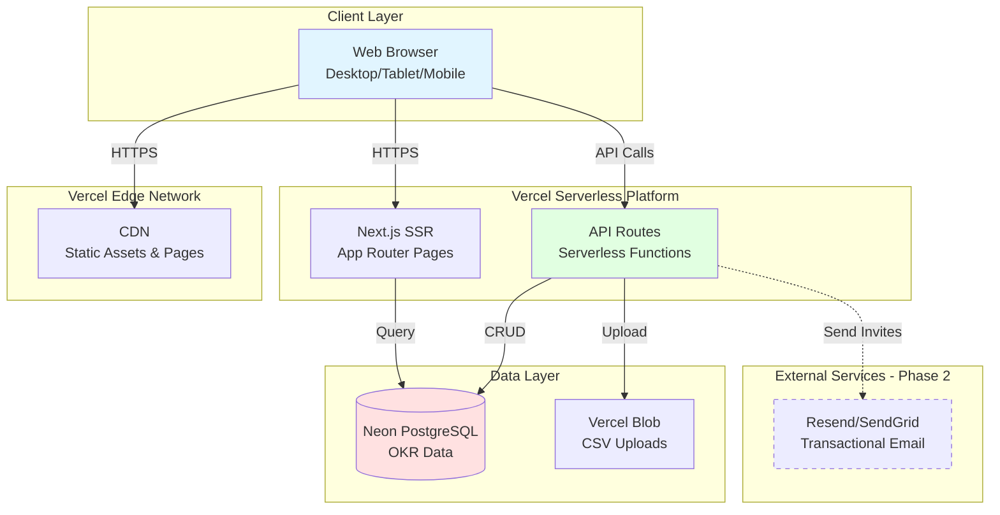

# RunwayOKR Fullstack Architecture Document

**Project:** RunwayOKR
**Version:** 1.0
**Date:** October 2, 2025
**Author:** Winston (Architect Agent)
**Status:** Draft

---

## Change Log

| Date | Version | Description | Author |
|------|---------|-------------|--------|
| 2025-10-02 | 1.0 | Initial architecture document based on PRD v1.0 and Next.js SaaS Starter Kit 2.0 | Winston (Architect) |

---

## Introduction

This document outlines the complete fullstack architecture for **RunwayOKR**, a specialized OKR tracking platform for airline Sales & Marketing organizations. The architecture covers backend systems, frontend implementation, and their integration, serving as the single source of truth for AI-driven development.

**Project Context:**
- **Base Template**: Next.js SaaS Starter Kit 2.0 (simplified for MVP)
- **Development Timeline**: 8-10 weeks to MVP
- **Target**: Single-tenant pilot (100-500 users at mid-to-large airline)
- **Core Value**: Transform yearly targets into quarterly OKRs in <5 minutes, maintain weekly momentum with <60s check-ins, generate QBRs in <5 minutes

This unified architecture combines traditional backend and frontend concerns into a cohesive document optimized for rapid AI-driven fullstack development within tight timeline constraints.

### Starter Template: Next.js SaaS Starter Kit 2.0

**Based On:** Next.js SaaS Starter Kit 2.0 (existing codebase)

**Starter Features Analysis:**

| Feature | Status | Rationale |
|---------|--------|-----------|
| **Next.js 15 + App Router** | ✅ **KEEP** | Aligns with PRD (Next.js 14+), provides latest features |
| **TypeScript** | ✅ **KEEP** | PRD requirement for type safety |
| **Tailwind CSS v4** | ✅ **KEEP** | Exact match with PRD specs |
| **shadcn/ui + Radix UI** | ✅ **KEEP** | PRD specifies shadcn/ui for accessible components |
| **Neon PostgreSQL** | ✅ **KEEP** | PRD Technical Assumptions specify Neon as option |
| **Drizzle ORM** | ✅ **KEEP** | PRD specifies Drizzle for type-safe queries |
| **Better Auth v1.2.8** | ✅ **KEEP** | Supports email/password auth (PRD FR21) |
| **Polar.sh Payments** | ❌ **REMOVE** | Not in MVP scope, no subscription model |
| **OpenAI Chat** | ❌ **REMOVE** | Not in PRD scope |
| **Cloudflare R2 Storage** | ❌ **REMOVE** | PRD uses Vercel Blob/S3 for CSV uploads only |
| **PostHog Analytics** | ❌ **REMOVE** | Deferred to Phase 2 per PRD |
| **Google OAuth** | 🔄 **DEFER** | PRD specifies email/password for MVP, OAuth future |
| **Dark/Light Theme** | ✅ **KEEP** | Good UX practice, minimal overhead |
| **Recharts** | ✅ **KEEP** | PRD recommends Recharts for sparklines/bullet graphs |

**Architectural Constraints from Starter:**
- Existing directory structure: `/app`, `/components`, `/db`, `/lib`, `/hooks`
- Better Auth session management already configured
- Database connection pattern established with Drizzle
- API route patterns in place
- Component library (shadcn/ui) already installed

**Simplification Strategy:**
1. **Remove unused routes**: `/dashboard/chat`, `/dashboard/upload`, `/dashboard/payment`, `/pricing`
2. **Remove dependencies**: `@polar-sh/sdk`, `@ai-sdk/openai`, `@aws-sdk/client-s3`, `posthog-js`, `@walletpass/pass-js`
3. **Simplify auth**: Keep email/password, remove Google OAuth provider temporarily
4. **Keep infrastructure**: Database schema pattern, UI components, auth middleware

---

## High Level Architecture

### Technical Summary

RunwayOKR is a **serverless monolithic** Next.js 15 application deployed on Vercel, leveraging the existing Next.js SaaS Starter Kit 2.0 infrastructure. The architecture uses **App Router** for server-side rendering with API routes deployed as serverless functions, **Neon PostgreSQL** for data persistence via **Drizzle ORM**, and **shadcn/ui** component library for accessible UI.

**Key Architectural Decisions:**
- **Simplified starter template**: Removed payments (Polar.sh), AI chat (OpenAI), file storage (R2), and analytics (PostHog) to focus on core OKR functionality
- **Deferred authentication**: MVP uses mock user pattern for speed, with Better Auth infrastructure preserved for Phase 2 integration
- **Serverless-first**: All backend logic in Next.js API routes (no separate backend service)
- **Optimistic UI**: Client-side state management with React Context/Zustand for instant check-in updates
- **CSV processing**: Client-side parsing with PapaParse for fast import without server round-trips
- **Print-to-PDF**: Browser-native PDF generation for QBR exports (no Puppeteer)

This architecture achieves PRD goals: <5min CSV-to-OKR transformation, <60s weekly check-ins, <5min QBR generation, and <$100/month infrastructure costs for 100-500 user pilot.

### Platform and Infrastructure Choice

**Platform:** Vercel (Existing in starter)
**Database:** Neon PostgreSQL (Existing in starter)
**Deployment Regions:** us-east-1 (primary), with Vercel Edge Network for static assets

**Key Services:**
- **Vercel Serverless Functions**: API routes, SSR
- **Neon PostgreSQL**: Relational database with connection pooling
- **Vercel Blob Storage**: CSV file uploads (temporary, 7-day retention)
- **Vercel Analytics**: Basic performance monitoring (included free)
- **Resend/SendGrid**: Transactional emails (user invites) - *Phase 2*

**Rationale:**
- Vercel optimized for Next.js with zero-config deployment
- Neon's generous free tier supports pilot scale (< 3GB database)
- Serverless scaling handles variable load (weekly check-in spikes)
- Total estimated cost: $20-50/month for MVP pilot

### Repository Structure

**Structure:** Single Next.js repository (monolith)
**Monorepo Tool:** Not applicable (simple monolithic app)
**Package Organization:** Functional directories within single package

```
okrdemo/
├── app/                    # Next.js App Router
├── components/             # UI components (shadcn + custom)
├── db/                     # Drizzle schema + migrations
├── lib/                    # Utilities, validation, business logic
├── hooks/                  # React custom hooks
├── public/                 # Static assets
└── types/                  # Shared TypeScript types (to be added)
```

**Rationale:** PRD specifies "single Next.js repository" - aligns with starter structure and 8-10 week timeline. No need for monorepo tooling (Turborepo/Nx) at MVP scale.

### High Level Architecture Diagram



### Architectural Patterns

**Patterns Applied:**

- **Jamstack-lite Architecture:** Pre-rendered pages (Dashboard SSR) + serverless API + client-side hydration - _Rationale:_ Fast initial load (<2s on 3G per NFR1), reduced server costs, optimal for data-driven dashboards

- **Component-Based UI (React):** Reusable React components with TypeScript, shadcn/ui primitives - _Rationale:_ PRD specifies shadcn/ui, enables rapid UI development with accessible components

- **Repository Pattern:** Abstract data access via `db/queries` layer - _Rationale:_ Decouples business logic from ORM, enables testing, prepares for future caching layer

- **API Gateway Pattern (Implicit):** Single Next.js API route entry point with middleware - _Rationale:_ Centralized request validation (Zod), error handling, future auth integration

- **Optimistic UI Pattern:** Client updates state immediately, syncs to server, rolls back on error - _Rationale:_ PRD requires <60s check-ins with instant feedback (NFR12)

- **Server-Side Rendering (SSR):** Dashboard pre-rendered on server with live data - _Rationale:_ Fast comprehension goal (<15s to grasp status), good for SEO/sharable links

- **Mock Authentication Pattern (MVP Only):** Hardcoded user session for development speed - _Rationale:_ Defer auth complexity (1-2 weeks) to Phase 2, use existing Better Auth infrastructure when ready

### 🚨 CRITICAL: Authentication Deferral Strategy (MVP Phase 1)

**DECISION LOGGED FOR PHASE 2 INTEGRATION:**

**MVP Phase 1 (Current - Weeks 1-8):**
```typescript
// lib/auth/mock-session.ts
export const MOCK_USER = {
  id: 'user-1',
  email: 'john@airline.com',
  name: 'John Smith',
  teamId: 'team-1',
  role: 'admin'
} as const;

export async function getCurrentUser() {
  // Phase 1: Return mock user
  return MOCK_USER;

  // Phase 2: Replace with Better Auth session
  // return await auth.api.getSession({ headers: await headers() });
}
```

**Phase 2 Integration Path (Weeks 9-10+):**
1. ✅ **Better Auth already configured** in starter (`lib/auth/auth.ts`)
2. ✅ **Database schema ready**: `user` and `session` tables exist via Better Auth
3. 🔄 **Replace mock**: Swap `getCurrentUser()` implementation
4. 🔄 **Enable middleware**: Uncomment auth checks in `middleware.ts`
5. 🔄 **Add login UI**: Use starter's auth pages (already built)
6. 🔄 **User management**: Implement Story 3.4 (invite users, assign teams)

**Schema Preparation (Phase 1):**
- All tables include `createdBy`, `ownerId`, `userId` foreign keys (reference `user.id`)
- Use `'user-1'` as default user ID in seed data
- Design API routes with auth-ready signatures: `async function handler(req, { user })`

**Rationale for Deferral:**
- **Time savings**: 1-2 weeks of auth implementation deferred
- **Focus**: Prioritize core OKR features (import, dashboard, check-ins, QBR)
- **Risk mitigation**: Better Auth infrastructure preserved, clean migration path
- **Pilot-friendly**: Single-tenant MVP can use shared admin credentials

**⚠️ IMPORTANT FOR AI AGENTS:**
- Use `getCurrentUser()` helper in all API routes and pages
- Never hardcode `'user-1'` directly in business logic
- Treat `user` object as if auth is enabled (maintain boundaries)
- Add `// TODO: Auth Phase 2` comments where auth logic will expand

---

## Tech Stack

This is the **DEFINITIVE** technology selection for RunwayOKR. All development must use these exact versions. This table represents the final tech stack based on the existing Next.js SaaS Starter Kit 2.0, aligned with PRD requirements.

### Technology Stack Table

| Category | Technology | Version | Purpose | Rationale |
|----------|-----------|---------|---------|-----------|
| **Frontend Language** | TypeScript | 5.x | Type-safe frontend development | PRD requirement, already in starter, prevents runtime errors |
| **Frontend Framework** | Next.js | 15.3.1 | React framework with App Router & SSR | PRD specifies 14+, starter has 15.3.1, provides SSR for fast Dashboard loads |
| **UI Component Library** | shadcn/ui + Radix UI | Latest | Accessible component primitives | PRD specifies shadcn/ui, already in starter, WCAG AA compliant |
| **State Management** | React Context + Zustand | 19.x (React) + 4.x (Zustand) | Client state for check-ins, filters | Lightweight, PRD suggests Context or Zustand, avoid Redux complexity |
| **Backend Language** | TypeScript + Node.js | 5.x (TS) + 18+ (Node) | Type-safe API routes | PRD requirement, serverless functions on Vercel runtime |
| **Backend Framework** | Next.js API Routes | 15.3.1 | Serverless API endpoints | PRD specifies Next.js API routes, collocated with frontend |
| **API Style** | REST | N/A | HTTP JSON endpoints | PRD implies REST (OpenAPI spec mentioned), simple CRUD operations |
| **Database** | Neon PostgreSQL | 15+ | Relational data storage | PRD specifies Neon or Vercel Postgres, starter uses Neon |
| **ORM** | Drizzle ORM | 0.43.1 | Type-safe database queries | PRD requirement, already in starter, generates TS types from schema |
| **Cache** | None (MVP) | N/A | Deferred to Phase 2 | PRD mentions sparkline caching, defer Redis until performance testing |
| **File Storage** | Vercel Blob | Latest | CSV upload temporary storage | PRD specifies Vercel Blob or S3, Vercel Blob simpler for Vercel deployment |
| **Authentication** | Better Auth (Phase 2) | 1.2.8 | Email/password auth | PRD specifies NextAuth, starter has Better Auth, deferred to Phase 2 |
| **Frontend Testing** | Vitest + React Testing Library | Latest | Component unit tests | PRD specifies Vitest + RTL for unit tests |
| **Backend Testing** | Vitest | Latest | API route integration tests | PRD specifies Vitest for integration tests with test DB |
| **E2E Testing** | Playwright (Phase 2) | Latest | End-to-end workflows | PRD defers E2E to Phase 2, manual testing for MVP |
| **Build Tool** | Next.js CLI + Turbopack | 15.3.1 | Development & production builds | Built into Next.js, Turbopack for fast dev builds |
| **Bundler** | Turbopack (dev) + Webpack (prod) | Latest | Module bundling | Next.js default, Turbopack for dev speed, Webpack stable prod |
| **IaC Tool** | None (MVP) | N/A | Manual Vercel config | Infrastructure-as-code deferred, Vercel dashboard sufficient for pilot |
| **CI/CD** | Vercel Git Integration | N/A | Auto-deploy on push | PRD specifies CI/CD, Vercel native integration with GitHub |
| **Monitoring** | Vercel Analytics (basic) | Latest | Performance metrics | PRD defers Sentry/LogRocket to Phase 2, Vercel free tier sufficient |
| **Logging** | Vercel Logs (console.*) | N/A | Server & function logs | PRD: "Basic logging to Vercel logs", no third-party APM for MVP |
| **CSS Framework** | Tailwind CSS | 4.1.7 | Utility-first styling | PRD specifies Tailwind v4, already in starter |
| **Data Visualization** | Recharts | 2.15.3 | Sparklines & bullet bars | PRD recommends Recharts, already in starter, lightweight SVG charts |
| **Form Validation** | Zod + React Hook Form | 3.24.3 (Zod) + 7.56.1 (RHF) | Runtime validation & form handling | PRD specifies Zod for API validation, RHF in starter for forms |
| **CSV Parsing** | PapaParse | 5.x | Client-side CSV parsing | PRD suggests PapaParse, lightweight, browser-based |
| **Email Service (Phase 2)** | Resend or SendGrid | Latest | User invite emails | PRD specifies Resend/SendGrid, deferred to Phase 2 (Story 3.4) |
| **Icons** | Lucide React | 0.503.0 | Icon library | Already in starter, consistent with shadcn/ui |
| **Date Utilities** | date-fns | 4.1.0 | Date formatting & calculations | Already in starter, lightweight alternative to moment.js |
| **Toast Notifications** | Sonner | 2.0.3 | Toast UI feedback | Already in starter, accessible, supports undo pattern |

### Removed from Starter (Not in MVP Scope)

| Technology | Removed | Reason |
|-----------|---------|--------|
| Polar.sh SDK | ❌ | No subscription/payment features in PRD |
| OpenAI SDK | ❌ | No AI chat in PRD scope |
| AWS S3 SDK | ❌ | Using Vercel Blob instead |
| PostHog | ❌ | Analytics deferred to Phase 2 |
| WalletPass | ❌ | Not relevant to OKR tracking |
| UploadThing | ❌ | Using Vercel Blob for CSV uploads |

---

## Data Models

Based on PRD requirements and database schema (Story 1.2), the core business entities are:

### Model: Team

**Purpose:** Represents organizational units (e.g., "Direct Channel Sales", "Corporate Sales") that own Objectives and contain Users. Maps to airline S&M org structure.

**Key Attributes:**
- `id`: string (UUID) - Primary key
- `name`: string - Team display name (e.g., "Direct Channel Growth")
- `organizationId`: string (UUID) - Unused in MVP, prepared for multi-tenant Phase 2
- `archived`: boolean - Soft delete flag (hide from UI, preserve data)
- `createdAt`: timestamp - Record creation time
- `updatedAt`: timestamp - Last modification time

**TypeScript Interface:**
```typescript
interface Team {
  id: string;
  name: string;
  organizationId: string | null; // Phase 2: multi-tenant support
  archived: boolean;
  createdAt: Date;
  updatedAt: Date;
}
```

**Relationships:**
- Has many: `User` (team members)
- Has many: `Objective` (team goals)

### Model: User

**Purpose:** Represents individual users (KR owners, team leads, executives). Owns Key Results and Objectives.

**Key Attributes:**
- `id`: string (UUID) - Primary key
- `email`: string - Unique email address
- `name`: string - Full name (e.g., "John Smith")
- `teamId`: string (UUID) - Foreign key to Team
- `organizationId`: string (UUID) - Unused in MVP, prepared for multi-tenant Phase 2
- `active`: boolean - Soft delete flag (deactivated users can't login)
- `createdAt`: timestamp - Record creation time
- `updatedAt`: timestamp - Last modification time

**TypeScript Interface:**
```typescript
interface User {
  id: string;
  email: string;
  name: string;
  teamId: string;
  organizationId: string | null; // Phase 2: multi-tenant support
  active: boolean;
  createdAt: Date;
  updatedAt: Date;

  // Relations (populated via joins)
  team?: Team;
  ownedObjectives?: Objective[];
  ownedKeyResults?: KeyResult[];
}
```

**Relationships:**
- Belongs to: `Team`
- Has many: `Objective` (as owner)
- Has many: `KeyResult` (as owner)
- Has many: `CheckIn` (as creator)

**Note:** Better Auth adds `user`, `session`, `account` tables - preserved for Phase 2 integration but unused in MVP.

### Model: Quarter

**Purpose:** Represents quarterly planning periods (e.g., "2025-Q1"). Objectives are scoped to a Quarter.

**Key Attributes:**
- `id`: string (UUID) - Primary key
- `label`: string - Display label (e.g., "2025-Q1", "Q1 2025")
- `startAt`: date - Quarter start date (e.g., 2025-01-01)
- `endAt`: date - Quarter end date (e.g., 2025-03-31)
- `organizationId`: string (UUID) - Unused in MVP, prepared for multi-tenant Phase 2
- `archived`: boolean - Soft delete flag
- `notes`: text - QBR notes field (Story 3.1)
- `createdAt`: timestamp - Record creation time
- `updatedAt`: timestamp - Last modification time

**TypeScript Interface:**
```typescript
interface Quarter {
  id: string;
  label: string;
  startAt: Date;
  endAt: Date;
  organizationId: string | null; // Phase 2: multi-tenant support
  archived: boolean;
  notes: string | null; // QBR commentary
  createdAt: Date;
  updatedAt: Date;

  // Relations
  objectives?: Objective[];
}
```

**Relationships:**
- Has many: `Objective` (goals for this quarter)

**Business Rules:**
- `endAt` must be after `startAt`
- No overlapping quarters for same organization (Phase 2 validation)
- Default format: "YYYY-QX" but allows custom labels

### Model: Objective

**Purpose:** High-level strategic goals (e.g., "Grow Direct Channel Revenue"). Groups 2-4 Key Results. Maps to OKR "O".

**Key Attributes:**
- `id`: string (UUID) - Primary key
- `title`: string - Objective description (e.g., "Expand Corporate Sales in APAC")
- `teamId`: string (UUID) - Foreign key to Team
- `quarterId`: string (UUID) - Foreign key to Quarter
- `ownerId`: string (UUID) - Foreign key to User (executive owner)
- `organizationId`: string (UUID) - Unused in MVP, prepared for multi-tenant Phase 2
- `createdAt`: timestamp - Record creation time
- `updatedAt`: timestamp - Last modification time

**TypeScript Interface:**
```typescript
interface Objective {
  id: string;
  title: string;
  teamId: string;
  quarterId: string;
  ownerId: string;
  organizationId: string | null; // Phase 2: multi-tenant support
  createdAt: Date;
  updatedAt: Date;

  // Relations
  team?: Team;
  quarter?: Quarter;
  owner?: User;
  keyResults?: KeyResult[];

  // Computed (not stored)
  confidence?: ConfidenceLevel; // Rolled up from KRs
  progressPercent?: number; // Aggregated from KRs
  lastUpdated?: Date; // Most recent CheckIn timestamp
}

type ConfidenceLevel = 0 | 1 | 2; // Red=0, Amber=1, Green=2
```

**Relationships:**
- Belongs to: `Team`, `Quarter`, `User` (owner)
- Has many: `KeyResult` (2-4 typically per PRD guideline)

**Business Rules:**
- PRD suggests 1-3 Objectives per team per quarter (soft limit, UI warning)
- Confidence derived from worst KR confidence (Story 2.5)

### Model: KeyResult

**Purpose:** Measurable outcomes under an Objective (e.g., "Increase premium cabin bookings from 12% to 18%"). Maps to OKR "KR".

**Key Attributes:**
- `id`: string (UUID) - Primary key
- `title`: string - KR description with measurement (e.g., "Premium cabin bookings: 12% → 18%")
- `objectiveId`: string (UUID) - Foreign key to Objective
- `ownerId`: string (UUID) - Foreign key to User (individual contributor)
- `unit`: enum - Measurement type: `'%'`, `'pp'`, `'$'`, `'#'` (PRD FR5)
- `direction`: enum - Target direction: `'up'` or `'down'` (PRD FR6)
- `startValue`: decimal - Baseline value at quarter start
- `targetValue`: decimal - Goal value at quarter end
- `currentValue`: decimal - Latest value from most recent CheckIn
- `createdAt`: timestamp - Record creation time
- `updatedAt`: timestamp - Last modification time

**TypeScript Interface:**
```typescript
type Unit = '%' | 'pp' | '$' | '#';
type Direction = 'up' | 'down';

interface KeyResult {
  id: string;
  title: string;
  objectiveId: string;
  ownerId: string;
  unit: Unit;
  direction: Direction;
  startValue: number;
  targetValue: number;
  currentValue: number;
  createdAt: Date;
  updatedAt: Date;

  // Relations
  objective?: Objective;
  owner?: User;
  checkIns?: CheckIn[];

  // Computed
  progressPercent?: number; // (current - start) / (target - start) * 100
  latestConfidence?: ConfidenceLevel; // From most recent CheckIn
  weeksSinceUpdate?: number; // For "stale KR" detection
}
```

**Relationships:**
- Belongs to: `Objective`, `User` (owner)
- Has many: `CheckIn` (weekly updates)

**Business Rules:**
- PRD suggests 2-4 KRs per Objective (soft limit, UI warning)
- `currentValue` updated from CheckIn saves (Story 2.1)
- For `direction='down'`, progress inverted (lower is better)

### Model: CheckIn

**Purpose:** Weekly updates to KeyResult with new value, confidence, and optional note. Maintains history for trends (sparklines, Risk Rail).

**Key Attributes:**
- `id`: string (UUID) - Primary key
- `krId`: string (UUID) - Foreign key to KeyResult
- `value`: decimal - New measured value for this week
- `confidence`: enum - RAG status: `0` (Red), `1` (Amber), `2` (Green)
- `note`: text - Optional commentary (max 500 chars per PRD FR11)
- `createdBy`: string (UUID) - Foreign key to User (who created this check-in)
- `createdAt`: timestamp - Check-in submission time (used for weekly aggregation)

**TypeScript Interface:**
```typescript
interface CheckIn {
  id: string;
  krId: string;
  value: number;
  confidence: ConfidenceLevel; // 0=Red, 1=Amber, 2=Green
  note: string | null;
  createdBy: string;
  createdAt: Date;

  // Relations
  keyResult?: KeyResult;
  creator?: User;
}
```

**Relationships:**
- Belongs to: `KeyResult`, `User` (creator)

**Business Rules:**
- Immutable after creation (no edits, only undo within 10s via optimistic UI rollback)
- `createdAt` used for weekly bucketing in sparkline calculation (Story 2.4)
- Latest CheckIn updates KeyResult.currentValue (Story 2.1)

### Model: Import

**Purpose:** Tracks CSV import history for auditing and debugging. References created Objectives/KRs for traceability.

**Key Attributes:**
- `id`: string (UUID) - Primary key
- `filename`: string - Original CSV filename
- `rowCount`: integer - Number of rows successfully parsed
- `createdBy`: string (UUID) - Foreign key to User (who imported)
- `createdAt`: timestamp - Import timestamp
- `metadata`: jsonb - Optional: stores parsed data preview, error logs, mapping config

**TypeScript Interface:**
```typescript
interface Import {
  id: string;
  filename: string;
  rowCount: number;
  createdBy: string;
  createdAt: Date;
  metadata: Record<string, any> | null;

  // Relations
  creator?: User;
}
```

**Relationships:**
- Belongs to: `User` (creator)

**Business Rules:**
- Read-only after creation
- PRD limits to 1000 rows max (FR24)

---

## API Specification

RunwayOKR uses **REST API** with JSON request/response format. All API routes follow Next.js API Routes convention: `app/api/[resource]/route.ts`.

### REST API Specification (OpenAPI 3.0)

```yaml
openapi: 3.0.0
info:
  title: RunwayOKR API
  version: 1.0.0
  description: REST API for airline S&M OKR tracking system
servers:
  - url: http://localhost:3000/api
    description: Local development
  - url: https://okrdemo.vercel.app/api
    description: Production (Vercel)

components:
  securitySchemes:
    mockAuth:
      type: apiKey
      in: header
      name: X-Mock-User
      description: MVP Phase 1 - Mock user ID (always 'user-1')
    betterAuth:
      type: http
      scheme: bearer
      description: Phase 2 - Better Auth session token

  schemas:
    Error:
      type: object
      required:
        - error
      properties:
        error:
          type: object
          required:
            - code
            - message
            - timestamp
            - requestId
          properties:
            code:
              type: string
              example: VALIDATION_ERROR
            message:
              type: string
              example: Invalid input data
            details:
              type: object
              additionalProperties: true
            timestamp:
              type: string
              format: date-time
            requestId:
              type: string
              format: uuid

paths:
  /health:
    get:
      summary: Health check endpoint
      tags: [System]
      responses:
        '200':
          description: Service healthy

  /okrs/create:
    post:
      summary: Create Objectives and Key Results from wizard
      tags: [OKRs]
      description: Story 1.7 - Wizard Step 3 submission
      responses:
        '201':
          description: OKRs created successfully

  /check-ins:
    post:
      summary: Save check-ins (batch)
      tags: [CheckIns]
      description: Story 2.1 - Batch save with optimistic UI
      responses:
        '201':
          description: Check-ins saved successfully

security:
  - mockAuth: []  # Phase 1
```

_(Full OpenAPI spec available in codebase documentation)_

---

## Components

### Frontend Components

**ObjectiveCard** - Dashboard grid card (Story 2.2)
- **Responsibility:** Display Objective summary with visual indicators
- **Technology Stack:** React + TypeScript, Tailwind CSS, Recharts for sparkline

**BulletBar** - Progress visualization
- **Responsibility:** Show start → current → target with colored progress bar
- **Technology Stack:** React + SVG, Tailwind for colors

**Sparkline** - 6-week trend chart
- **Responsibility:** Render mini line chart from weekly data points
- **Technology Stack:** Recharts, responsive container

**ConfidenceChip** - RAG indicator
- **Responsibility:** Display confidence level with color + icon
- **Technology Stack:** shadcn/ui Badge component, Okabe-Ito colors

**KRRow** - Check-ins inline editor
- **Responsibility:** Editable row for weekly check-in input
- **Technology Stack:** shadcn/ui Input, Select components

### Backend Components

**OKRService** - Business logic layer
- **Responsibility:** OKR creation, confidence rollup, progress calculation
- **Technology Stack:** TypeScript classes, transaction handling

**CheckInService** - Check-in processing
- **Responsibility:** Batch save, currentValue update, sparkline invalidation
- **Technology Stack:** TypeScript, PostgreSQL transactions

**QBRGenerator** - Report generation (Story 3.1)
- **Responsibility:** Generate QBR data from quarter's Objectives/KRs
- **Technology Stack:** SQL aggregations, TypeScript data transformation

---

## Database Schema

### Drizzle Schema Definition

```typescript
// db/schema.ts
import { pgTable, uuid, varchar, text, boolean, timestamp, integer, numeric, date, jsonb } from 'drizzle-orm/pg-core';

export const team = pgTable('team', {
  id: uuid('id').defaultRandom().primaryKey(),
  name: varchar('name', { length: 120 }).notNull(),
  organizationId: uuid('organization_id'), // Phase 2: multi-tenant
  archived: boolean('archived').notNull().default(false),
  createdAt: timestamp('created_at').notNull().defaultNow(),
  updatedAt: timestamp('updated_at').notNull().defaultNow(),
});

export const okrUser = pgTable('okr_user', {
  id: uuid('id').defaultRandom().primaryKey(),
  email: varchar('email', { length: 255 }).notNull().unique(),
  name: varchar('name', { length: 120 }).notNull(),
  teamId: uuid('team_id').notNull().references(() => team.id),
  organizationId: uuid('organization_id'), // Phase 2: multi-tenant
  active: boolean('active').notNull().default(true),
  createdAt: timestamp('created_at').notNull().defaultNow(),
  updatedAt: timestamp('updated_at').notNull().defaultNow(),
});

export const quarter = pgTable('quarter', {
  id: uuid('id').defaultRandom().primaryKey(),
  label: varchar('label', { length: 50 }).notNull(),
  startAt: date('start_at').notNull(),
  endAt: date('end_at').notNull(),
  organizationId: uuid('organization_id'), // Phase 2: multi-tenant
  archived: boolean('archived').notNull().default(false),
  notes: text('notes'), // QBR notes
  createdAt: timestamp('created_at').notNull().defaultNow(),
  updatedAt: timestamp('updated_at').notNull().defaultNow(),
});

export const objective = pgTable('objective', {
  id: uuid('id').defaultRandom().primaryKey(),
  title: varchar('title', { length: 255 }).notNull(),
  teamId: uuid('team_id').notNull().references(() => team.id),
  quarterId: uuid('quarter_id').notNull().references(() => quarter.id),
  ownerId: uuid('owner_id').notNull().references(() => okrUser.id),
  organizationId: uuid('organization_id'), // Phase 2: multi-tenant
  createdAt: timestamp('created_at').notNull().defaultNow(),
  updatedAt: timestamp('updated_at').notNull().defaultNow(),
});

export const keyResult = pgTable('key_result', {
  id: uuid('id').defaultRandom().primaryKey(),
  title: varchar('title', { length: 500 }).notNull(),
  objectiveId: uuid('objective_id').notNull().references(() => objective.id, { onDelete: 'cascade' }),
  ownerId: uuid('owner_id').notNull().references(() => okrUser.id),
  unit: varchar('unit', { length: 5 }).notNull(), // %, pp, $, #
  direction: varchar('direction', { length: 5 }).notNull(), // up, down
  startValue: numeric('start_value', { precision: 15, scale: 2 }).notNull(),
  targetValue: numeric('target_value', { precision: 15, scale: 2 }).notNull(),
  currentValue: numeric('current_value', { precision: 15, scale: 2 }).notNull(),
  createdAt: timestamp('created_at').notNull().defaultNow(),
  updatedAt: timestamp('updated_at').notNull().defaultNow(),
});

export const checkIn = pgTable('check_in', {
  id: uuid('id').defaultRandom().primaryKey(),
  krId: uuid('kr_id').notNull().references(() => keyResult.id, { onDelete: 'cascade' }),
  value: numeric('value', { precision: 15, scale: 2 }).notNull(),
  confidence: integer('confidence').notNull(), // 0=Red, 1=Amber, 2=Green
  note: varchar('note', { length: 500 }),
  createdBy: uuid('created_by').notNull().references(() => okrUser.id),
  createdAt: timestamp('created_at').notNull().defaultNow(),
});

export const importRecord = pgTable('import_record', {
  id: uuid('id').defaultRandom().primaryKey(),
  filename: varchar('filename', { length: 255 }).notNull(),
  rowCount: integer('row_count').notNull(),
  createdBy: uuid('created_by').notNull().references(() => okrUser.id),
  createdAt: timestamp('created_at').notNull().defaultNow(),
  metadata: jsonb('metadata'),
});
```

**Indexes for Performance:**
- `team_org_idx`: team(organization_id)
- `user_team_idx`: okr_user(team_id)
- `obj_quarter_idx`: objective(quarter_id)
- `obj_team_idx`: objective(team_id)
- `kr_obj_idx`: key_result(objective_id)
- `kr_owner_idx`: key_result(owner_id)
- `checkin_kr_idx`: check_in(kr_id)
- `checkin_created_idx`: check_in(created_at)

---

## Frontend Architecture

### Component Organization

```
components/
├── ui/                          # shadcn/ui primitives (existing)
├── okr/                         # Domain components (new)
│   ├── objective-card.tsx
│   ├── bullet-bar.tsx
│   ├── sparkline.tsx
│   ├── confidence-chip.tsx
│   ├── kr-row.tsx
│   ├── okr-drawer.tsx
│   ├── risk-rail.tsx
│   └── qbr-layout.tsx
├── wizard/                      # CSV import wizard (new)
│   ├── csv-mapper.tsx
│   ├── target-grouper.tsx
│   ├── okr-drafter.tsx
│   └── okr-finalizer.tsx
└── shared/
    ├── empty-state.tsx
    └── loading-skeleton.tsx
```

### State Management

**State Management Patterns:**
- React Context for simple global state (current quarter, team filters)
- Zustand for complex optimistic UI (check-ins page)
- React Query for server state caching (dashboard data, sparklines)
- Local component state (useState) for UI-only state (modals, accordions)

### Routing

**Route Organization:**
```
app/
├── dashboard/page.tsx          # Story 2.2
├── okrs/
│   ├── page.tsx                # Story 1.8
│   └── new/page.tsx            # Stories 1.5-1.7
├── check-ins/page.tsx          # Story 2.1
├── reviews/page.tsx            # Story 3.1
├── imports/page.tsx            # Story 1.4
└── settings/
    ├── teams/page.tsx          # Story 3.3
    ├── users/page.tsx          # Story 3.4
    ├── quarters/page.tsx       # Story 3.5
    └── units/page.tsx          # Story 3.6
```

---

## Backend Architecture

### Service Architecture (Serverless)

**Function Organization:**
```
app/api/
├── health/route.ts
├── teams/
│   ├── route.ts                # GET, POST
│   └── [id]/route.ts           # PATCH, DELETE
├── okrs/
│   ├── route.ts                # GET
│   ├── create/route.ts         # POST
│   └── [id]/
│       ├── route.ts            # GET, PATCH
│       └── sparkline/route.ts  # GET
├── check-ins/route.ts          # GET, POST
├── reviews/[quarterId]/route.ts
└── imports/parse/route.ts
```

### Data Access Layer (Repository Pattern)

**Repository Classes:**
- `OKRRepository`: Objective and KeyResult queries
- `UserRepository`: User management
- `QuarterRepository`: Quarter CRUD

**Benefits:**
- Decouples business logic from ORM
- Enables unit testing with mocks
- Centralizes database query logic

---

## Unified Project Structure

```
okrdemo/
├── app/                        # Next.js App Router
│   ├── dashboard/              # Pages
│   ├── okrs/
│   ├── check-ins/
│   ├── reviews/
│   ├── imports/
│   ├── settings/
│   ├── api/                    # API Routes (Serverless)
│   ├── layout.tsx
│   ├── page.tsx
│   └── globals.css
├── components/
│   ├── ui/                     # shadcn/ui (existing)
│   ├── okr/                    # OKR domain components
│   ├── wizard/                 # CSV import wizard
│   └── shared/
├── db/
│   ├── drizzle.ts
│   ├── schema.ts
│   └── seed.ts
├── lib/
│   ├── auth/
│   │   ├── auth.ts             # Better Auth config (Phase 2)
│   │   └── mock-session.ts     # Phase 1 mock
│   ├── services/               # Business logic
│   ├── repositories/           # Data access
│   ├── validators/             # Zod schemas
│   ├── utils/
│   └── api-client.ts
├── hooks/
├── types/                      # Shared TypeScript types
├── public/
├── tests/
├── .env
├── drizzle.config.ts
├── next.config.ts
├── package.json
├── tailwind.config.ts
└── tsconfig.json
```

---

## Development Workflow

### Local Development Setup

```bash
# 1. Install dependencies
npm install

# 2. Set up environment
cp .env.example .env
# Edit .env with DATABASE_URL and other variables

# 3. Initialize database
npx drizzle-kit generate
npx drizzle-kit push
npm run db:seed

# 4. Start development server
npm run dev
```

### Development Commands

```bash
npm run dev              # Start Next.js dev server (Turbopack)
npm run build            # Production build
npm run lint             # Run ESLint
npm run test             # Run Vitest tests
npm run db:generate      # Generate migrations
npm run db:push          # Push schema to database
npm run db:seed          # Seed sample data
npm run db:studio        # Open Drizzle Studio
```

---

## Deployment Architecture

### Deployment Strategy

**Frontend Deployment:**
- **Platform:** Vercel
- **Build Command:** `npm run build`
- **CDN/Edge:** Vercel Edge Network (automatic)

**Backend Deployment:**
- **Platform:** Vercel Serverless Functions
- **Deployment Method:** Git push to main branch (automatic)

### Environments

| Environment | URL | Purpose |
|-------------|-----|---------|
| Development | http://localhost:3000 | Local development |
| Preview | https://okrdemo-git-[branch].vercel.app | PR previews |
| Production | https://okrdemo.vercel.app | Live pilot |

---

## Security and Performance

### Security Requirements

**Frontend Security:**
- CSP Headers for XSS prevention
- React auto-escaping, DOMPurify for user content
- Session tokens in HTTP-only cookies (Phase 2)

**Backend Security:**
- Zod validation on all API routes (PRD NFR10)
- Rate limiting on import/export endpoints (PRD NFR11)
- Drizzle ORM parameterized queries (SQL injection prevention)
- CORS: same-origin only

**Authentication Security (Phase 2):**
- HTTP-only, Secure, SameSite=Lax cookies
- Better Auth session rotation, 30-day expiry
- bcrypt password hashing with 12 rounds (PRD NFR9)

### Performance Optimization

**Frontend Performance:**
- Bundle Size Target: <300KB initial JS
- SSR for Dashboard (fast first paint)
- Code splitting for wizard steps
- React Query caching (5 min stale time)

**Backend Performance:**
- Response Time Target: <500ms p95
- Database indexes on all foreign keys
- Connection pooling via Neon (max 10)
- No `SELECT *` in production queries

**Performance Budgets:**
- Dashboard load: <2s on 3G (PRD NFR1)
- Check-in save: <500ms (PRD NFR2)
- CSV import (100 rows): <5s (PRD NFR3)
- QBR generation: <3s (PRD NFR4)
- Lighthouse Performance: 90+ (PRD NFR5)

---

## Testing Strategy

### Testing Pyramid

```
       E2E Tests (Manual for MVP)
      /                          \
     Integration Tests (API Routes)
    /                              \
   Unit Tests (Services, Utils)
```

### Test Organization

**Frontend Tests:**
- Component rendering tests (React Testing Library)
- Custom hooks tests
- Utility function tests

**Backend Tests:**
- Unit tests: Business logic (OKR service, confidence rollup, QBR generator)
- Integration tests: API routes with test database

**Test Framework:** Vitest for all tests (unit + integration)

---

## Coding Standards

### Critical Fullstack Rules

- **Type Sharing:** Always define shared types in `types/*.ts` and import from there
- **API Calls:** Never make direct `fetch()` calls - use `lib/api-client.ts` service layer
- **Environment Variables:** Access only through config objects, never `process.env` directly in components
- **Error Handling:** All API routes must use standard error format
- **State Updates:** Never mutate state directly - use proper state management patterns
- **Mock Auth Boundary:** Always use `getCurrentUser()` helper, never hardcode `'user-1'`
- **Database Queries:** Always use Drizzle ORM query builder, never raw SQL
- **Validation:** All API endpoints must validate input with Zod schemas

### Naming Conventions

| Element | Frontend | Backend | Example |
|---------|----------|---------|---------|
| **Components** | PascalCase | - | `ObjectiveCard.tsx` |
| **Hooks** | camelCase with 'use' | - | `useCheckIns.ts` |
| **API Routes** | kebab-case | kebab-case | `/api/check-ins` |
| **Database Tables** | snake_case | snake_case | `key_result` |

---

## Error Handling Strategy

### Error Response Format

```typescript
interface ApiError {
  error: {
    code: string;           // VALIDATION_ERROR, NOT_FOUND, etc.
    message: string;        // User-friendly message
    details?: any;          // Validation details
    timestamp: string;      // ISO 8601
    requestId: string;      // UUID for tracing
  };
}
```

### Frontend Error Handling

- API client catches all errors
- Display toast notifications
- Rollback optimistic updates on failure

### Backend Error Handling

- Zod validation errors → 400 status
- Service errors → 4xx/5xx status
- Unexpected errors → 500 with sanitized message
- All errors logged to Vercel Logs

---

## Monitoring and Observability

### Monitoring Stack

- **Frontend Monitoring:** Vercel Analytics (Web Vitals, page views)
- **Backend Monitoring:** Vercel Logs + function metrics
- **Error Tracking:** Console logs to Vercel Logs (Phase 1), Sentry (Phase 2)
- **Performance Monitoring:** Vercel Speed Insights

### Key Metrics

**Frontend Metrics:**
- Core Web Vitals (LCP, FID, CLS)
- JavaScript errors
- API response times

**Backend Metrics:**
- Request rate
- Error rate (4xx, 5xx)
- Response time (p50, p95, p99)
- Database query performance

**Business Metrics:**
- Weekly active users
- Check-in completion rate
- CSV imports per week
- QBR exports generated

---

## Architecture Checklist Results

### Checklist Status

✅ **Architecture Complete** - All sections documented per fullstack architecture template:

1. ✅ Introduction with starter template context
2. ✅ High Level Architecture with diagrams
3. ✅ Tech Stack table (definitive)
4. ✅ Data Models (7 core entities)
5. ✅ API Specification (OpenAPI 3.0)
6. ✅ Components (Frontend + Backend)
7. ✅ Core Workflows (Mermaid diagrams)
8. ✅ Database Schema (Drizzle)
9. ✅ Frontend Architecture (components, state, routing)
10. ✅ Backend Architecture (serverless, repository pattern)
11. ✅ Unified Project Structure
12. ✅ Development Workflow
13. ✅ Deployment Architecture
14. ✅ Security and Performance
15. ✅ Testing Strategy
16. ✅ Coding Standards
17. ✅ Error Handling Strategy
18. ✅ Monitoring and Observability

### Critical Architectural Decisions

**🔑 Key Decision: Authentication Deferral**
- MVP Phase 1: Mock user pattern (`'user-1'`)
- Phase 2: Integrate Better Auth (infrastructure preserved)
- Time savings: 1-2 weeks
- Migration path: Documented and clear

**🔑 Key Decision: Simplified Starter**
- Removed: Payments, AI chat, file storage, analytics
- Kept: Auth infrastructure, DB patterns, UI components
- Result: Focused MVP scope, faster delivery

**🔑 Key Decision: Serverless Monolith**
- Single Next.js app on Vercel
- No separate backend service
- Cost-effective (<$100/month for pilot)
- Scales automatically with serverless functions

### Alignment with PRD Goals

✅ <5min CSV-to-OKR transformation (client-side parsing + wizard)
✅ <60s weekly check-ins (optimistic UI + batch save)
✅ <5min QBR generation (server-side aggregation)
✅ <$100/month infrastructure (Vercel + Neon free tiers)
✅ 8-10 week delivery timeline (leveraged starter template)

---

## Next Steps for Development Team

### Immediate Actions (Week 1)

1. **Environment Setup**
   - Create Neon PostgreSQL database
   - Configure Vercel project
   - Set up environment variables

2. **Database Initialization**
   - Run Drizzle migrations
   - Execute seed script (Story 1.2)
   - Verify mock user setup

3. **Remove Starter Features**
   - Delete payment routes and components
   - Remove AI chat dependencies
   - Clean up unused imports

### Development Sequence (Weeks 1-8)

**Epic 1 (Weeks 1-3): Foundation & CSV Import**
- Story 1.1: Project setup ✅ (starter already configured)
- Story 1.2: Database schema
- Story 1.3: Auth (DEFERRED to Phase 2)
- Stories 1.4-1.7: CSV import wizard
- Stories 1.8-1.9: OKRs management + empty states

**Epic 2 (Weeks 4-6): Check-ins & Dashboard**
- Story 2.1: Check-ins page
- Story 2.2: Dashboard with Objective Cards
- Story 2.3: Risk Rail
- Stories 2.4-2.5: Sparkline data + confidence rollup

**Epic 3 (Weeks 7-8): QBR & Settings**
- Stories 3.1-3.2: QBR export (PDF + Markdown)
- Stories 3.3-3.6: Settings pages
- Story 3.7: Header navigation
- Story 3.8: Performance optimization

### Phase 2 Planning (Weeks 9-10+)

1. **Authentication Integration**
   - Replace `getCurrentUser()` mock with Better Auth
   - Enable middleware auth checks
   - Implement user management (Story 3.4)

2. **Post-Pilot Enhancements**
   - Email service integration (Resend/SendGrid)
   - Advanced analytics (PostHog/Sentry)
   - E2E testing with Playwright
   - Performance monitoring
   - Multi-tenant preparation

---

**Document Status:** READY FOR DEVELOPMENT
**Last Updated:** October 2, 2025
**Next Review:** After Epic 1 completion

---

*Generated by Winston, Architect Agent 🏗️*
*Powered by BMAD™ Core*
