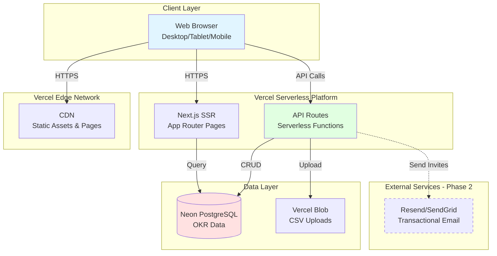

# High Level Architecture

### Technical Summary

RunwayOKR is a **serverless monolithic** Next.js 15 application deployed on Vercel, leveraging the existing Next.js SaaS Starter Kit 2.0 infrastructure. The architecture uses **App Router** for server-side rendering with API routes deployed as serverless functions, **Neon PostgreSQL** for data persistence via **Drizzle ORM**, and **shadcn/ui** component library for accessible UI.

**Key Architectural Decisions:**
- **Simplified starter template**: Removed payments (Polar.sh), AI chat (OpenAI), file storage (R2), and analytics (PostHog) to focus on core OKR functionality
- **Deferred authentication**: MVP uses mock user pattern for speed, with Better Auth infrastructure preserved for Phase 2 integration
- **Serverless-first**: All backend logic in Next.js API routes (no separate backend service)
- **Optimistic UI**: Client-side state management with React Context/Zustand for instant check-in updates
- **CSV processing**: Client-side parsing with PapaParse for fast import without server round-trips
- **Print-to-PDF**: Browser-native PDF generation for QBR exports (no Puppeteer)

This architecture achieves PRD goals: <5min CSV-to-OKR transformation, <60s weekly check-ins, <5min QBR generation, and <$100/month infrastructure costs for 100-500 user pilot.

### Platform and Infrastructure Choice

**Platform:** Vercel (Existing in starter)
**Database:** Neon PostgreSQL (Existing in starter)
**Deployment Regions:** us-east-1 (primary), with Vercel Edge Network for static assets

**Key Services:**
- **Vercel Serverless Functions**: API routes, SSR
- **Neon PostgreSQL**: Relational database with connection pooling
- **Vercel Blob Storage**: CSV file uploads (temporary, 7-day retention)
- **Vercel Analytics**: Basic performance monitoring (included free)
- **Resend/SendGrid**: Transactional emails (user invites) - *Phase 2*

**Rationale:**
- Vercel optimized for Next.js with zero-config deployment
- Neon's generous free tier supports pilot scale (< 3GB database)
- Serverless scaling handles variable load (weekly check-in spikes)
- Total estimated cost: $20-50/month for MVP pilot

### Repository Structure

**Structure:** Single Next.js repository (monolith)
**Monorepo Tool:** Not applicable (simple monolithic app)
**Package Organization:** Functional directories within single package

```
okrdemo/
├── app/                    # Next.js App Router
├── components/             # UI components (shadcn + custom)
├── db/                     # Drizzle schema + migrations
├── lib/                    # Utilities, validation, business logic
├── hooks/                  # React custom hooks
├── public/                 # Static assets
└── types/                  # Shared TypeScript types (to be added)
```

**Rationale:** PRD specifies "single Next.js repository" - aligns with starter structure and 8-10 week timeline. No need for monorepo tooling (Turborepo/Nx) at MVP scale.

### High Level Architecture Diagram



### Architectural Patterns

**Patterns Applied:**

- **Jamstack-lite Architecture:** Pre-rendered pages (Dashboard SSR) + serverless API + client-side hydration - _Rationale:_ Fast initial load (<2s on 3G per NFR1), reduced server costs, optimal for data-driven dashboards

- **Component-Based UI (React):** Reusable React components with TypeScript, shadcn/ui primitives - _Rationale:_ PRD specifies shadcn/ui, enables rapid UI development with accessible components

- **Repository Pattern:** Abstract data access via `db/queries` layer - _Rationale:_ Decouples business logic from ORM, enables testing, prepares for future caching layer

- **API Gateway Pattern (Implicit):** Single Next.js API route entry point with middleware - _Rationale:_ Centralized request validation (Zod), error handling, future auth integration

- **Optimistic UI Pattern:** Client updates state immediately, syncs to server, rolls back on error - _Rationale:_ PRD requires <60s check-ins with instant feedback (NFR12)

- **Server-Side Rendering (SSR):** Dashboard pre-rendered on server with live data - _Rationale:_ Fast comprehension goal (<15s to grasp status), good for SEO/sharable links

- **Mock Authentication Pattern (MVP Only):** Hardcoded user session for development speed - _Rationale:_ Defer auth complexity (1-2 weeks) to Phase 2, use existing Better Auth infrastructure when ready

### 🚨 CRITICAL: Authentication Deferral Strategy (MVP Phase 1)

**DECISION LOGGED FOR PHASE 2 INTEGRATION:**

**MVP Phase 1 (Current - Weeks 1-8):**
```typescript
// lib/auth/mock-session.ts
export const MOCK_USER = {
  id: 'user-1',
  email: 'john@airline.com',
  name: 'John Smith',
  teamId: 'team-1',
  role: 'admin'
} as const;

export async function getCurrentUser() {
  // Phase 1: Return mock user
  return MOCK_USER;

  // Phase 2: Replace with Better Auth session
  // return await auth.api.getSession({ headers: await headers() });
}
```

**Phase 2 Integration Path (Weeks 9-10+):**
1. ✅ **Better Auth already configured** in starter (`lib/auth/auth.ts`)
2. ✅ **Database schema ready**: `user` and `session` tables exist via Better Auth
3. 🔄 **Replace mock**: Swap `getCurrentUser()` implementation
4. 🔄 **Enable middleware**: Uncomment auth checks in `middleware.ts`
5. 🔄 **Add login UI**: Use starter's auth pages (already built)
6. 🔄 **User management**: Implement Story 3.4 (invite users, assign teams)

**Schema Preparation (Phase 1):**
- All tables include `createdBy`, `ownerId`, `userId` foreign keys (reference `user.id`)
- Use `'user-1'` as default user ID in seed data
- Design API routes with auth-ready signatures: `async function handler(req, { user })`

**Rationale for Deferral:**
- **Time savings**: 1-2 weeks of auth implementation deferred
- **Focus**: Prioritize core OKR features (import, dashboard, check-ins, QBR)
- **Risk mitigation**: Better Auth infrastructure preserved, clean migration path
- **Pilot-friendly**: Single-tenant MVP can use shared admin credentials

**⚠️ IMPORTANT FOR AI AGENTS:**
- Use `getCurrentUser()` helper in all API routes and pages
- Never hardcode `'user-1'` directly in business logic
- Treat `user` object as if auth is enabled (maintain boundaries)
- Add `// TODO: Auth Phase 2` comments where auth logic will expand

---

