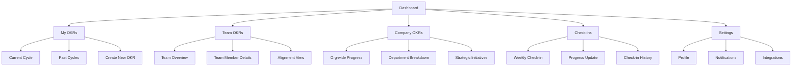
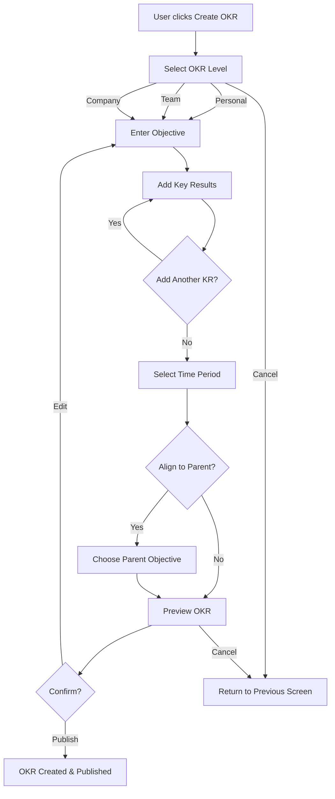
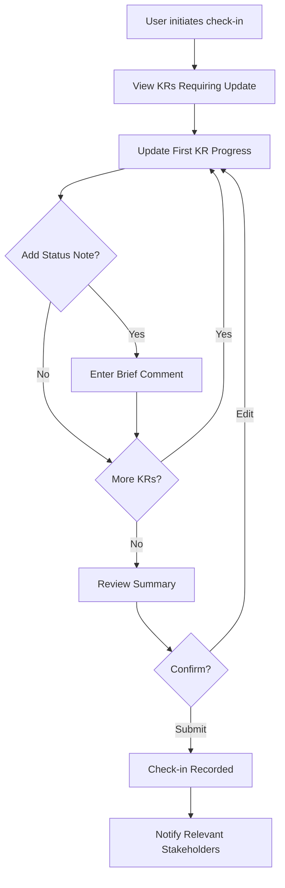
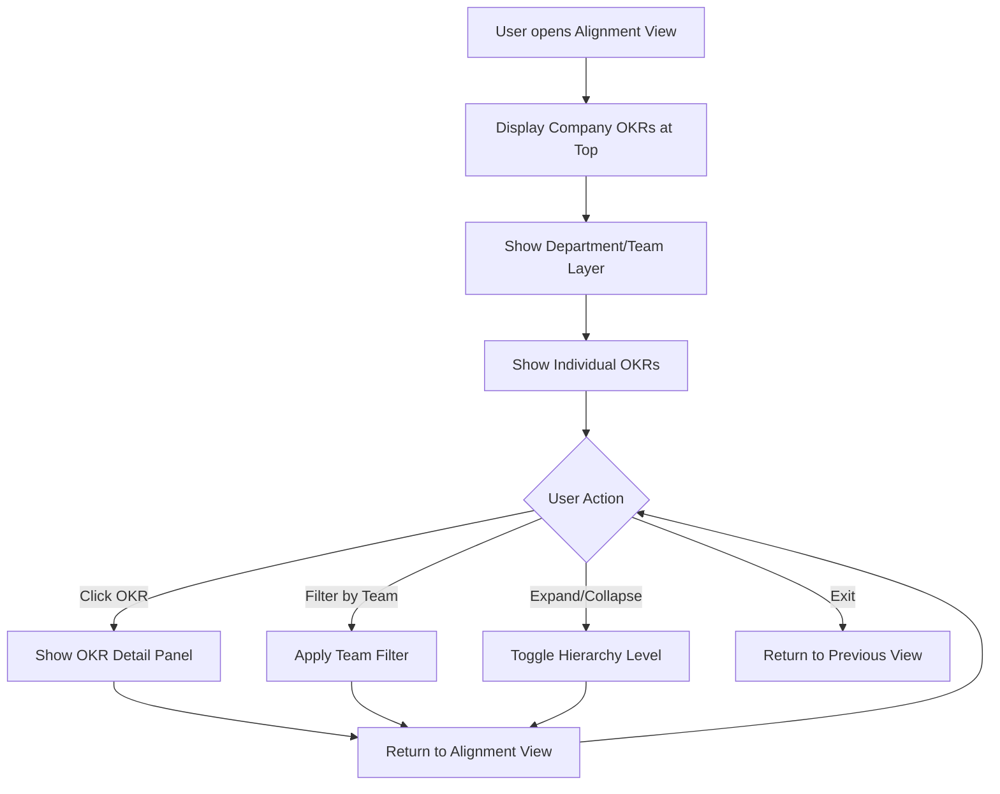

# OKR Demo UI/UX Specification

This document defines the user experience goals, information architecture, user flows, and visual design specifications for OKR Demo's user interface. It serves as the foundation for visual design and frontend development, ensuring a cohesive and user-centered experience.

## Introduction

### Overall UX Goals & Principles

#### Target User Personas

1. **Team Lead/Manager:** Professionals responsible for setting and tracking team objectives. Need quick visibility into team progress, ability to align individual OKRs with company goals, and efficient check-in workflows.

2. **Individual Contributor:** Team members who own specific key results. Prioritize ease of updating progress, clarity on what's expected, and understanding how their work contributes to larger goals.

3. **Executive/C-Suite:** Leadership needing high-level dashboards showing organizational alignment, progress trends, and potential risks. Value data visualization and strategic insights over operational details.

#### Usability Goals

- **Rapid onboarding:** New users can create their first OKR within 3 minutes
- **Effortless updates:** Users can update progress in under 30 seconds via async check-ins
- **Clear hierarchy:** Visual representation makes goal alignment immediately obvious
- **Mobile-friendly:** Core tasks (viewing progress, quick updates) work seamlessly on mobile
- **Cognitive ease:** Interface feels lightweight, not overwhelming like traditional PM tools

#### Design Principles

1. **Clarity over cleverness** - Prioritize clear communication over aesthetic innovation. OKRs are about transparency.
2. **Progressive disclosure** - Show summary views by default, detailed breakdowns on demand. Avoid information overload.
3. **Rhythm over rigidity** - Design for weekly check-in cadences with gentle nudges, not strict enforcement.
4. **Visual hierarchy first** - Use color, size, and layout to communicate goal importance and progress at a glance.
5. **Speed is a feature** - Every interaction should feel snappy. Minimize clicks, maximize clarity.

#### Change Log

| Date | Version | Description | Author |
|------|---------|-------------|---------|
| 2025-10-02 | 1.0 | Initial specification created | Sally (UX Expert) |

## Information Architecture (IA)

### Site Map / Screen Inventory

### Navigation Structure

**Primary Navigation:** Tab-based navigation at top level with 4 main sections:
- Dashboard (home/overview)
- OKRs (with context switcher for My/Team/Company)
- Check-ins (async update workflow)
- Settings (profile, preferences, integrations)

**Secondary Navigation:**
- Context switcher within OKR section (My/Team/Company toggle)
- Time period selector (Current Cycle / Past Cycles)
- Quick action floating button for "New OKR" and "Quick Update"

**Breadcrumb Strategy:**
- Minimal breadcrumbs since depth is shallow (max 2-3 levels)
- Breadcrumbs show hierarchy only when drilling into Team Member details or specific OKR details
- Format: Dashboard > Team OKRs > John Doe > Q1 2025

## User Flows

### Flow 1: Create New OKR

**User Goal:** Create and publish a new Objective with associated Key Results

**Entry Points:**
- Dashboard "Quick Action" button
- OKRs page "Create New OKR" button
- Empty state prompts for first-time users

**Success Criteria:** OKR is created, aligned to parent objective (if applicable), and visible to relevant team members

#### Flow Diagram

#### Edge Cases & Error Handling:

- User tries to create KR without measurable metric → Show inline validation requiring unit/target
- User attempts to align to own objective → Prevent circular dependency with error message
- Network failure during save → Auto-save draft locally, show retry banner
- User abandons mid-flow → Prompt to save as draft before exiting
- Duplicate objective detected → Suggest existing OKR, offer to proceed anyway

**Notes:** Consider wizard-style multi-step form for first-time users, single-page form for power users (togglable preference)

### Flow 2: Weekly Check-in Update

**User Goal:** Quickly update progress on key results as part of weekly rhythm

**Entry Points:**
- Weekly reminder notification (push/email)
- Check-ins tab
- Inline update from Dashboard or OKRs view

**Success Criteria:** Progress percentages updated, optional status comment added, team visibility maintained

#### Flow Diagram

#### Edge Cases & Error Handling:

- Progress decreases significantly → Prompt for explanation before submitting
- User skips KR updates → Allow partial check-in, flag incomplete items
- Multiple updates in same day → Consolidate or show history timeline
- KR already at 100% → Offer to mark as complete, suggest celebration moment
- User behind on check-ins → Show catch-up mode with batch update option

**Notes:** Optimize for mobile speed - large touch targets, minimal typing, smart defaults

### Flow 3: View Team Alignment

**User Goal:** Understand how team/individual OKRs connect to company objectives

**Entry Points:**
- Team OKRs > Alignment View
- Dashboard "Alignment" widget
- Individual OKR detail page "Show Alignment"

**Success Criteria:** User can visualize hierarchical goal connections and identify misalignments

#### Flow Diagram

#### Edge Cases & Error Handling:

- Too many OKRs to display → Implement virtual scrolling, collapse by default
- Unaligned OKRs exist → Highlight in warning color, suggest parent objectives
- Circular dependencies → Detect and show error state with resolution suggestions
- User lacks permission to view certain OKRs → Show placeholder with "Restricted" label
- Empty state (no OKRs in cycle) → Show instructional empty state with "Create First OKR" CTA

**Notes:** Consider graph visualization library for complex alignment trees, maintain performance with 50+ OKRs

## Wireframes & Mockups

**Primary Design Files:** To be created in Figma/design tool of choice

### Key Screen Layouts

#### Screen 1: Dashboard (Home)

**Purpose:** Provide at-a-glance overview of personal progress, team status, and upcoming check-ins

**Key Elements:**
- Hero metric card: Personal OKR completion percentage with trend indicator
- "My Active OKRs" widget: List of current objectives with progress bars
- "Team Snapshot" widget: Aggregated team progress with drill-down capability
- "Upcoming Check-ins" reminder: Due date countdown with quick action button
- "Recent Activity" feed: Updates from team members (optional, collapsible)
- Quick action floating button: "New OKR" and "Quick Update" shortcuts

**Interaction Notes:**
- Progress bars are interactive - clicking expands to show key results
- Widgets can be reordered via drag-and-drop (personalization)
- Hero metric animates on load to draw attention
- Empty states for first-time users guide to "Create First OKR"

**Design File Reference:** [To be added in Figma]

#### Screen 2: OKRs List View (My/Team/Company)

**Purpose:** Display filterable, sortable list of objectives with hierarchical key results

**Key Elements:**
- Context switcher tabs: My / Team / Company
- Time period selector dropdown: Current Cycle / Q1 2025 / Q4 2024, etc.
- Filter/sort controls: By owner, by progress, by status (On Track / At Risk / Behind)
- OKR cards: Each card shows Objective title, progress bar, key result count, owner avatar
- Expandable key results: Click to reveal KRs inline within card
- Status indicators: Color-coded badges (Green/Yellow/Red) for health
- Action buttons: "Add KR", "Update Progress", "View Details"

**Interaction Notes:**
- Infinite scroll or pagination for large lists
- Hover states reveal quick action buttons
- Expand/collapse all toggle for power users
- Bulk actions: Select multiple OKRs for batch operations (archive, export)
- Search bar with autocomplete for objective titles and owners

**Design File Reference:** [To be added in Figma]

#### Screen 3: Create/Edit OKR Form

**Purpose:** Guide users through OKR creation with validation and alignment suggestions

**Key Elements:**
- Step indicator: If using wizard mode (Step 1 of 4)
- Objective input: Large text field with character counter (max 100 chars)
- Level selector: Radio buttons for Personal / Team / Company
- Key Results section: Repeatable form fields (KR description, starting value, target value, unit)
- Add KR button: Prominent, inline below last KR
- Alignment selector: Searchable dropdown to link to parent objective
- Time period picker: Quarterly by default, customizable date range
- Preview pane: Right sidebar showing formatted OKR (if screen width allows)
- Action buttons: Cancel (secondary), Save Draft (secondary), Publish (primary)

**Interaction Notes:**
- Inline validation for required fields and format checking
- Auto-suggest parent objectives based on team/level selection
- Progress indicators for multi-step wizard mode
- Keyboard shortcuts: Cmd/Ctrl+Enter to submit, Escape to cancel
- Unsaved changes warning on navigation away

**Design File Reference:** [To be added in Figma]

#### Screen 4: Check-in Modal/Drawer

**Purpose:** Streamlined, focused interface for quick progress updates

**Key Elements:**
- Header: Week of [Date Range] Check-in
- KR list: Each KR shows current progress, input for new value, optional comment field
- Progress slider: Visual slider for percentage-based KRs (0-100%)
- Numeric input: For value-based KRs (e.g., $50k of $100k)
- Status selector: Dropdown for On Track / At Risk / Behind (per KR or overall)
- Comment box: Optional text area for context (collapsed by default, "Add note" link)
- Summary view: Review all changes before submitting
- Action buttons: Skip for Now (link), Submit Check-in (primary button)

**Interaction Notes:**
- Modal overlay on desktop, full-screen drawer on mobile
- Tab navigation between KR inputs
- Auto-save drafts every 30 seconds
- Success animation and confirmation on submit
- Option to "Notify team" checkbox before submitting

**Design File Reference:** [To be added in Figma]

#### Screen 5: Alignment View (Visual Hierarchy)

**Purpose:** Tree or graph visualization showing OKR relationships and dependencies

**Key Elements:**
- Zoom controls: +/- buttons and fit-to-screen
- Legend: Color coding explanation (by status, by team, etc.)
- Company OKRs layer: Top-level nodes, larger size
- Department/Team layer: Mid-level nodes, grouped by color
- Individual OKRs layer: Leaf nodes, smaller size, expandable
- Connection lines: Visual lines showing parent-child relationships
- Detail panel: Side panel or tooltip showing OKR details on click
- Filter controls: By team, by status, by owner
- Export button: Download as PNG/PDF for presentations

**Interaction Notes:**
- Pan and zoom with mouse/trackpad gestures
- Click node to select and show detail panel
- Hover shows quick preview tooltip
- Drag nodes to adjust layout (if using force-directed graph)
- Collapse/expand branches for focus
- Highlight path from selected node to root

**Design File Reference:** [To be added in Figma]

## Component Library / Design System

**Design System Approach:** Build a lightweight, custom component library optimized for OKR-specific patterns. Leverage existing UI primitives from a base system (e.g., Radix UI, Headless UI) for accessibility, then customize visuals to match brand. Focus on components that appear repeatedly across OKR workflows.

### Core Components

#### Component 1: Progress Bar

**Purpose:** Visual indicator of key result or objective completion percentage

**Variants:**
- Linear (default): Horizontal bar for list views and cards
- Circular: Ring/donut chart for dashboard hero metrics
- Stacked: Multi-segment bar showing multiple KRs within an objective

**States:**
- Default: Neutral fill color
- On Track: Green fill (≥70% of expected progress)
- At Risk: Yellow/orange fill (50-69% of expected)
- Behind: Red fill (<50% of expected)
- Complete: Green with checkmark icon (100%)
- Disabled: Gray, reduced opacity

**Usage Guidelines:**
- Always show percentage label (e.g., "67%")
- Include tooltip on hover showing absolute values (e.g., "$67k of $100k")
- Animate progress changes smoothly (300ms ease-out transition)
- Minimum height: 8px for accessibility/touch targets
- Use color + pattern (stripes/texture) for colorblind accessibility

#### Component 2: OKR Card

**Purpose:** Compact, scannable display of objective with expandable key results

**Variants:**
- Compact: Single-line objective with collapsed KRs (list view)
- Expanded: Shows all KRs inline (detail view)
- Featured: Larger size with additional metadata for dashboard

**States:**
- Default: White background, subtle border
- Hover: Elevated shadow, reveal quick actions
- Selected: Highlighted border (e.g., blue accent)
- Dragging: Reduced opacity, cursor changes (for reordering)
- Loading: Skeleton/shimmer while fetching data

**Usage Guidelines:**
- Objective title is always visible and truncated with ellipsis if too long
- Show owner avatar(s), time period badge, and aggregate progress bar
- Quick actions (edit, archive, view details) appear on hover
- Support keyboard navigation (Tab to focus, Enter to expand)
- Maximum card width: 800px for readability

#### Component 3: Status Badge

**Purpose:** Quick visual indicator of OKR health/status

**Variants:**
- Dot only: Minimal, just colored circle (for dense views)
- Dot + Label: Circle with text label (default)
- Pill: Filled rounded rectangle with label (for emphasis)

**States:**
- On Track: Green (#10B981)
- At Risk: Yellow/amber (#F59E0B)
- Behind: Red (#EF4444)
- Not Started: Gray (#6B7280)
- Complete: Green with checkmark (#10B981)
- Draft: Outline only, not filled

**Usage Guidelines:**
- Use consistent color coding across all contexts
- Provide text label for screen readers (not just color)
- Hover shows tooltip with more context (e.g., "At Risk: 2 KRs behind schedule")
- Size variants: Small (16px), Medium (20px), Large (24px)

#### Component 4: Check-in Form

**Purpose:** Reusable form pattern for updating progress on key results

**Variants:**
- Inline: Embedded within OKR card for quick updates
- Modal: Overlay for focused check-in session
- Drawer: Slide-in panel on mobile

**States:**
- Empty: Placeholder text prompts user input
- Filled: Shows current values and accepts new input
- Validating: Shows inline error messages for invalid data
- Saving: Loading state with progress indicator
- Success: Confirmation message with undo option

**Usage Guidelines:**
- Always show previous value for comparison context
- Use appropriate input type (slider for %, number input for values)
- Include optional comment field (collapsed by default)
- Auto-calculate percentage from absolute values when possible
- Save draft to local storage every 30 seconds

#### Component 5: Alignment Tree Node

**Purpose:** Visual node in hierarchical OKR alignment graph

**Variants:**
- Company: Largest node, distinct styling (e.g., hexagon shape)
- Team: Medium node, grouped by color
- Individual: Smallest node, circular
- Collapsed: Shows count of hidden children

**States:**
- Default: Solid fill with title
- Hover: Elevated, shows quick preview tooltip
- Selected: Highlighted border, triggers detail panel
- Connected: Lines show parent-child relationships
- Orphaned: Dashed border indicating no parent alignment

**Usage Guidelines:**
- Node size reflects OKR level in hierarchy
- Color coding by status (green/yellow/red) or by team (configurable)
- Show objective title (truncated) and progress percentage
- Support click to expand/collapse children
- Animate transitions when zooming or filtering

#### Component 6: Empty State

**Purpose:** Guide users when no data exists yet, provide clear next steps

**Variants:**
- First-time: Onboarding-focused, educational
- Filtered: Explains why no results match current filters
- Error: Shows error message with retry action

**States:**
- Default: Illustration + headline + description + CTA
- Loading: Skeleton state while checking for data

**Usage Guidelines:**
- Use friendly, encouraging tone ("Let's create your first OKR!")
- Include relevant illustration or icon
- Primary CTA button should be prominent (e.g., "Create OKR")
- Provide secondary action if applicable (e.g., "Watch tutorial")
- Ensure consistent spacing and alignment across empty states

## Branding & Style Guide

### Visual Identity

**Brand Guidelines:** To be developed or linked to existing company brand guidelines

### Color Palette

| Color Type | Hex Code | Usage |
|------------|----------|-------|
| Primary | #3B82F6 | Primary actions, links, brand elements |
| Secondary | #8B5CF6 | Secondary actions, accents, highlights |
| Accent | #06B6D4 | Call-to-action elements, interactive highlights |
| Success | #10B981 | Positive feedback, on-track status, confirmations |
| Warning | #F59E0B | Cautions, at-risk status, important notices |
| Error | #EF4444 | Errors, behind status, destructive actions |
| Neutral | #F9FAFB (bg), #111827 (text), #E5E7EB (borders) | Text, borders, backgrounds, subtle UI elements |

### Typography

#### Font Families

- **Primary:** Inter (system: -apple-system, BlinkMacSystemFont, "Segoe UI")
- **Secondary:** Inter (same as primary for consistency)
- **Monospace:** 'JetBrains Mono', 'Fira Code', monospace (for numeric values, data)

#### Type Scale

| Element | Size | Weight | Line Height |
|---------|------|--------|-------------|
| H1 | 36px / 2.25rem | 700 (Bold) | 1.2 (43px) |
| H2 | 30px / 1.875rem | 600 (Semibold) | 1.3 (39px) |
| H3 | 24px / 1.5rem | 600 (Semibold) | 1.4 (34px) |
| Body | 16px / 1rem | 400 (Regular) | 1.5 (24px) |
| Small | 14px / 0.875rem | 400 (Regular) | 1.5 (21px) |

### Iconography

**Icon Library:** Heroicons (or Lucide Icons) - consistent, modern, MIT licensed

**Usage Guidelines:**
- Default size: 20px for inline icons, 24px for standalone
- Stroke width: 2px (medium weight) for consistency with Inter font
- Use outlined style for default state, filled for active/selected states
- Color: Inherit from text color for consistency (currentColor)
- Ensure 1:1 aspect ratio for all icons

### Spacing & Layout

**Grid System:** 12-column grid for desktop, 4-column for mobile, with 24px gutters

**Spacing Scale:** Base 4px (0.25rem) scale
- 4px (xs), 8px (sm), 12px (md), 16px (lg), 24px (xl), 32px (2xl), 48px (3xl), 64px (4xl)
- Use consistently for margins, padding, gaps
- Component spacing follows 8px baseline grid for vertical rhythm

## Accessibility Requirements

### Compliance Target

**Standard:** WCAG 2.1 Level AA compliance

### Key Requirements

**Visual:**
- Color contrast ratios: Minimum 4.5:1 for normal text, 3:1 for large text (18px+) and UI components
- Focus indicators: Visible 2px outline with 3:1 contrast against background, never remove focus styles
- Text sizing: Support browser zoom up to 200%, all text remains readable and functional

**Interaction:**
- Keyboard navigation: All interactive elements accessible via Tab, Enter, Space, Arrow keys. Logical tab order follows visual flow
- Screen reader support: Semantic HTML (nav, main, article), ARIA labels for icon buttons, live regions for dynamic updates
- Touch targets: Minimum 44×44px for all interactive elements (buttons, links, form controls)

**Content:**
- Alternative text: All informational images, icons, and charts have descriptive alt text or aria-label
- Heading structure: Proper hierarchy (H1→H2→H3), no skipped levels, one H1 per page
- Form labels: Visible labels for all inputs, grouped with fieldset/legend, clear error messages associated with aria-describedby

### Testing Strategy

- Automated testing with axe-core or Lighthouse in CI/CD pipeline
- Manual keyboard navigation testing for all user flows
- Screen reader testing with NVDA (Windows) and VoiceOver (Mac/iOS)
- Color contrast verification for all color combinations
- User testing with assistive technology users during beta phase

## Responsiveness Strategy

### Breakpoints

| Breakpoint | Min Width | Max Width | Target Devices |
|------------|-----------|-----------|----------------|
| Mobile | 320px | 767px | Smartphones (portrait/landscape) |
| Tablet | 768px | 1023px | Tablets, small laptops |
| Desktop | 1024px | 1439px | Standard desktop monitors |
| Wide | 1440px | - | Large monitors, external displays |

### Adaptation Patterns

**Layout Changes:**
- Mobile: Single column, stacked widgets, full-width cards
- Tablet: 2-column grid where appropriate, sidebar collapses to drawer
- Desktop: Multi-column layouts, persistent sidebar navigation
- Wide: Max content width 1280px centered, additional whitespace on sides

**Navigation Changes:**
- Mobile: Hamburger menu with drawer, bottom tab bar for primary nav
- Tablet: Top tab bar, collapsible sidebar for secondary nav
- Desktop/Wide: Persistent top navigation bar with all options visible

**Content Priority:**
- Mobile: Hide "Recent Activity" feed, collapse dashboard widgets, show only essential KR details
- Tablet: Show condensed versions of secondary content
- Desktop/Wide: Full content with all details and optional panels

**Interaction Changes:**
- Mobile: Bottom sheets for modals, swipe gestures for navigation, larger touch targets
- Tablet: Modal overlays, hybrid touch + keyboard support
- Desktop/Wide: Hover states, keyboard shortcuts, mouse-optimized interactions

## Animation & Micro-interactions

### Motion Principles

- **Purposeful movement:** Animations guide attention and clarify relationships, not for decoration
- **Snappy timing:** Fast transitions (200-300ms) maintain perception of speed
- **Respect preferences:** Honor prefers-reduced-motion for accessibility
- **Consistent easing:** Use standard easing curves (ease-out for entrances, ease-in for exits)

### Key Animations

- **Progress bar updates:** Smooth fill animation with ease-out timing (Duration: 300ms, Easing: cubic-bezier(0.4, 0, 0.2, 1))
- **Card hover elevation:** Subtle shadow increase on hover (Duration: 150ms, Easing: ease-out)
- **Modal/drawer entrance:** Slide + fade in from edge (Duration: 250ms, Easing: ease-out)
- **Success celebrations:** Confetti or checkmark bounce on 100% completion (Duration: 600ms, Easing: spring)
- **Status badge changes:** Color cross-fade when status updates (Duration: 200ms, Easing: ease-in-out)
- **Expand/collapse:** Height transition with content fade (Duration: 300ms, Easing: ease-in-out)
- **Loading states:** Skeleton shimmer animation (Duration: 1500ms, Easing: linear, infinite loop)
- **Page transitions:** Subtle fade between routes (Duration: 200ms, Easing: ease-in-out)

## Performance Considerations

### Performance Goals

- **Page Load:** Initial page load under 2 seconds on 4G connection
- **Interaction Response:** UI responds to user input within 100ms
- **Animation FPS:** Maintain 60fps for all animations and scrolling

### Design Strategies

- Use progressive loading: Show skeleton screens while data loads
- Implement virtual scrolling for lists with 50+ items
- Optimize images: Use WebP format with fallbacks, lazy load below-the-fold images
- Minimize layout shifts: Reserve space for dynamic content with placeholders
- Debounce search and filter inputs to reduce unnecessary API calls
- Use optimistic UI updates: Show changes immediately, sync in background
- Implement service worker for offline capability and faster repeat visits

## Next Steps

### Immediate Actions

1. Review this specification with stakeholders and gather feedback
2. Create detailed mockups in Figma based on wireframe layouts and component specs
3. Set up design tokens (colors, typography, spacing) in design tool and code
4. Begin component library development with accessibility primitives
5. Conduct design critique session with development team for feasibility review

### Design Handoff Checklist

- [x] All user flows documented
- [x] Component inventory complete
- [x] Accessibility requirements defined
- [x] Responsive strategy clear
- [x] Brand guidelines incorporated
- [x] Performance goals established

